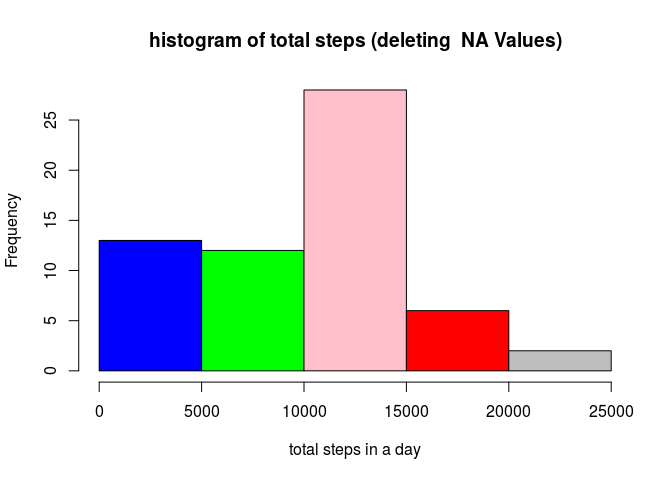
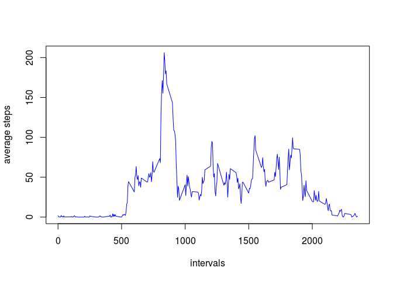
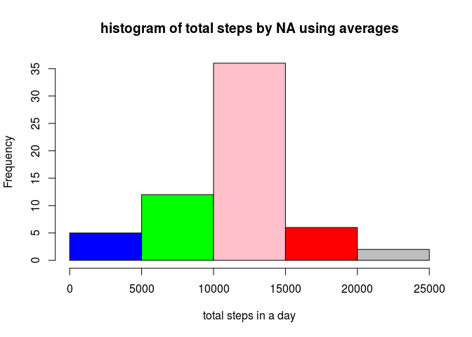
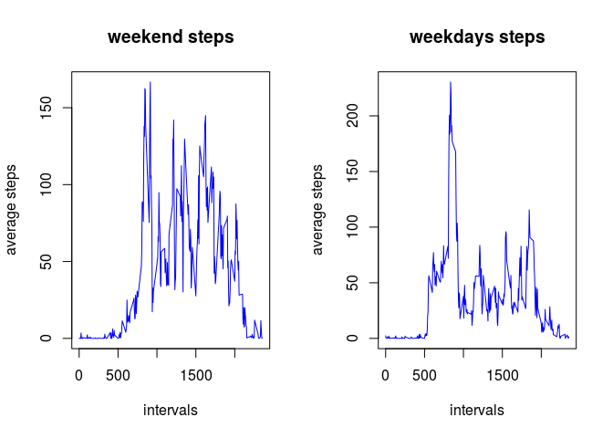

# Reproducible Research: Peer Assessment 1

## Loading and preprocessing the data

```r
library(dplyr)
```

```
## 
## Attaching package: 'dplyr'
```

```
## The following objects are masked from 'package:stats':
## 
##     filter, lag
```

```
## The following objects are masked from 'package:base':
## 
##     intersect, setdiff, setequal, union
```

```r
par(mfrow=c(1,1))
myData<-read.csv("activity.csv")
head(myData)
```

```
##   steps       date interval
## 1    NA 2012-10-01        0
## 2    NA 2012-10-01        5
## 3    NA 2012-10-01       10
## 4    NA 2012-10-01       15
## 5    NA 2012-10-01       20
## 6    NA 2012-10-01       25
```
## What is total number of steps taken per day?

```r
res<-aggregate(myData$steps, by=list(myData$date), sum , na.rm=TRUE, na.action=NULL )
names(res)<-c("date","total.number.steps")
print(head(res))
```

```
##         date total.number.steps
## 1 2012-10-01                  0
## 2 2012-10-02                126
## 3 2012-10-03              11352
## 4 2012-10-04              12116
## 5 2012-10-05              13294
## 6 2012-10-06              15420
```

#### Making a histogram of the total number of steps taken each day

```r
clr<-c("blue","green","pink","red","gray")
hist(res$total.number.steps,main="histogram of total steps (deleting  NA Values)",xlab="total steps in a day",col=clr)
```



## Calculate and report the mean and median of the total number of steps taken per day


```r
resMean<-aggregate(myData$steps, by=list(myData$date), function(x) mean(x, na.rm=TRUE)  )
resMean[is.na(resMean$x),"x"]<-0
names(resMean)<-c("date","mean.number.steps")
head(resMean)
```

```
##         date mean.number.steps
## 1 2012-10-01           0.00000
## 2 2012-10-02           0.43750
## 3 2012-10-03          39.41667
## 4 2012-10-04          42.06944
## 5 2012-10-05          46.15972
## 6 2012-10-06          53.54167
```

```r
resMedian<-aggregate(myData$steps, by=list(myData$date), median ,na.rm=TRUE)
resMedian[is.na(resMedian$x),"x"]<-0
names(resMedian)<-c("date","median.number.steps")
head(resMedian)
```

```
##         date median.number.steps
## 1 2012-10-01                   0
## 2 2012-10-02                   0
## 3 2012-10-03                   0
## 4 2012-10-04                   0
## 5 2012-10-05                   0
## 6 2012-10-06                   0
```

## What is the average daily activity pattern?

```r
avgSteps<-aggregate(myData$steps, by=list(myData$interval), mean ,na.rm=TRUE)  
names(avgSteps)<-c("interval","average.steps")
plot(x=avgSteps$interval, y=avgSteps$average.steps,type="l" ,xlab="intervals",ylab="average steps",col="blue")
```



## the interval where number of steps are maximum 


```r
result<-subset(avgSteps,average.steps==max(avgSteps$average.steps)) 
print(result)
```

```
##     interval average.steps
## 104      835      206.1698
```
###### as expected it's at 8'Oclock between 8:35 and 8:40 -> time to go  work 
## Imputing missing values

##### number of rows containing NA values

```r
numberValues<-nrow(myData)-nrow(na.omit(myData))
print(numberValues)
```

```
## [1] 2304
```

##### let's replace each na by average by interval

```r
names(avgSteps)<-c("interval","altSteps")
myDataBis<-inner_join(myData,avgSteps)
```

```
## Joining by: "interval"
```

```r
myDataBis[is.na(myDataBis$steps),"steps"]<-myDataBis[is.na(myDataBis$steps),"altSteps"]
head(myDataBis)
```

```
##       steps       date interval  altSteps
## 1 1.7169811 2012-10-01        0 1.7169811
## 2 0.3396226 2012-10-01        5 0.3396226
## 3 0.1320755 2012-10-01       10 0.1320755
## 4 0.1509434 2012-10-01       15 0.1509434
## 5 0.0754717 2012-10-01       20 0.0754717
## 6 2.0943396 2012-10-01       25 2.0943396
```

##### let's plot again the histogram of part using the modified na values

```r
avgStepsBis<-aggregate(myDataBis$steps, by=list(myDataBis$date), sum ,na.rm=TRUE)  
hist(avgStepsBis$x,main="histogram of total steps by NA using averages",xlab="total steps in a day",col=clr)
```




## Are there differences in activity patterns between weekdays and weekends?

```r
myDataBis$dateFormatted<-as.Date(myDataBis$date, format="%Y-%m-%d")
myDataBis$weeks<-weekdays(myDataBis$dateFormatted, abbr = TRUE)

myDataWeekEnd<-myDataBis[myDataBis$weeks %in%c("sam.","dim."),]
myDataWeekIn<-myDataBis[myDataBis$weeks %in%c("lun.","mar.","mer.","jeu.","ven."),]

par(mfrow=c(1,2))
resMeanWeekEnd<-aggregate(myDataWeekEnd$steps, by=list(myDataWeekEnd$interval), function(x) mean(x, na.rm=TRUE)  )
plot(x=resMeanWeekEnd$Group.1, y=resMeanWeekEnd$x,type="l" ,main="weekend steps",xlab="intervals",ylab="average steps",col="blue")

resMeanWeekIn<-aggregate(myDataWeekIn$steps, by=list(myDataWeekIn$interval), function(x) mean(x, na.rm=TRUE)  )
plot(x=resMeanWeekIn$Group.1, y=resMeanWeekIn$x,type="l",main="weekdays steps" ,xlab="intervals",ylab="average steps",col="blue")
```



##### We can see clearly that we have more activity in the day during  weekend than in weekdays (may be the subjects are sitting at work during weekdays) 
#####


